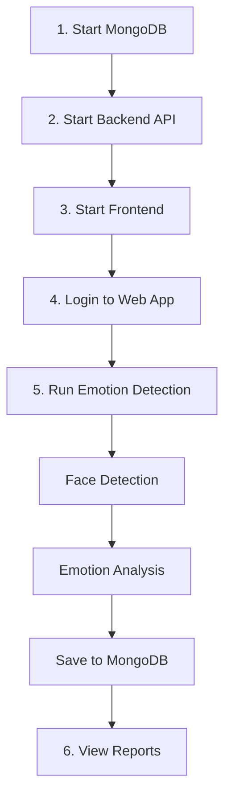

# 🎭 EMOTION DATABASE SYSTEM - Quick Start

## ⚡ Khởi động siêu nhanh (1 lệnh)

```powershell
.\start-full-system.bat
```

Hoặc xem bên dưới để khởi động từng phần.

---

## 📋 Pre-requisites

### Cần có
- ✅ MongoDB installed & running
- ✅ Node.js v16+ 
- ✅ Visual Studio 2022 Build Tools
- ✅ npm packages installed

### Quick Check
```powershell
# Check MongoDB
tasklist | findstr mongod

# Check Node.js
node --version

# Check npm
npm --version
```

---

## 🚀 Step-by-Step Startup

### 1️⃣ Start MongoDB
```powershell
# Option A: Service
net start MongoDB

# Option B: Manual  
"C:\Program Files\MongoDB\Server\7.0\bin\mongod.exe" --dbpath "C:\data\db"
```

Verify: `mongodb://localhost:27017`

### 2️⃣ Start Backend API
```powershell
cd Backend
npm install   # First time only
npm start
```

✅ Backend ready: `http://localhost:5000`

### 3️⃣ Start Frontend
```powershell
cd Frontend
npm install   # First time only  
npm start
```

✅ Frontend ready: `http://localhost:3000`

### 4️⃣ Run Emotion Detection

**Camera:**
```powershell
cd Emotion-statistics
.\run_main.bat
```

**Video:**
```powershell
cd Emotion-statistics
.\main.exe MobileNet_custom.onnx "path/to/video.mp4"
```

**Controls:**
- ESC = Exit
- Data tự động sync lên MongoDB

### 5️⃣ View Reports

1. Open: `http://localhost:3000`
2. Login (admin or user)
3. Navigate: **📊 Báo cáo**
4. Select session from list
5. View charts & statistics

---

## 📊 What You'll See

### Reports Page Layout

```
┌─────────────────────┬──────────────────────────────┐
│  SESSIONS LIST      │  STATISTICS PANEL            │
│  (left sidebar)     │  (main area)                 │
├─────────────────────┼──────────────────────────────┤
│ • Camera_0_143022   │  📈 Session Overview         │
│   ✓ Completed       │  • 3 Faces, 500 Frames      │
│   📹 Camera (0)     │                              │
│   Faces: 3          │  🎭 Emotion Distribution     │
│                     │  [Pie Chart]                 │
│ • video_150000      │                              │
│   🎬 Video          │  👤 Face Analysis            │
│   ...               │  [Bar Chart]                 │
│                     │                              │
│                     │  📋 Detail Table             │
│                     │  [Statistics Table]          │
└─────────────────────┴──────────────────────────────┘
```

---

## 🔄 Complete Workflow



### Data Flow

```
C++ App          →  HTTP POST  →  Backend API
(main.exe)                        (Express.js)
                                       ↓
                                  MongoDB
                                  (emotion-detection DB)
                                       ↓
                                  Backend API
                                       ↓
                                  Frontend
                                  (Reports Page)
```

---

## 🎯 Key Features

### ✅ What Works

| Feature | Status | Description |
|---------|--------|-------------|
| Face Detection | ✅ | YuNet model |
| Emotion Recognition | ✅ | MobileNet custom |
| Face Tracking | ✅ | TrackerNano |
| Database Storage | ✅ | MongoDB |
| REST API | ✅ | 8 endpoints |
| Web Dashboard | ✅ | React SPA |
| Reports & Charts | ✅ | Recharts |
| Multi-source | ✅ | Camera & Video |
| Auto Sync | ✅ | C++ → API → DB |

---

## 📁 Project Structure

```
LoginAuthMERN_MVC/
│
├── Backend/                 # API Server (Port 5000)
│   ├── src/
│   │   ├── models/
│   │   │   └── Emotion.js   ⭐ NEW: 3 schemas
│   │   ├── controllers/
│   │   │   └── EmotionController.js  ⭐ UPDATED: 10+ endpoints
│   │   └── routes/
│   │       └── EmotionRoutes.js      ⭐ UPDATED: API routes
│   └── testMongoConnection.js  ⭐ NEW: Test script
│
├── Frontend/                # React App (Port 3000)
│   └── src/Components/Reports/
│       ├── Reports.js       ⭐ COMPLETELY REWRITTEN
│       └── Reports.css      ⭐ UPDATED: New styles
│
├── Emotion-statistics/      # C++ App
│   ├── main.cpp            ⭐ UPDATED: API integration
│   │                          + httplib.h
│   │                          + createSession()
│   │                          + sendEmotionBatch()
│   │                          + updateSessionStatus()
│   │                          + calculateStatistics()
│   ├── include/
│   │   └── httplib.h
│   └── face_logs/          ⭐ Auto-organized by session
│       └── Camera_0_20251108_143022/
│           ├── ID0/
│           ├── ID1/
│           └── ...
│
├── start-full-system.bat   ⭐ NEW: Launch script
├── EMOTION_DATABASE_INTEGRATION.md  ⭐ NEW: Full docs
└── EMOTION_QUICKSTART.md   ⭐ THIS FILE
```

---

## 🛠️ Configuration

### Backend (.env)
```env
MONGO_URI=mongodb://localhost:27017/emotion-detection
PORT=5000
JWT_SECRET=your_jwt_secret_key_here
```

### C++ (main.cpp - lines 24-27)
```cpp
const std::string API_HOST = "localhost";
const int API_PORT = 5000;
const bool ENABLE_API_SYNC = true;  // Set false to disable API
const int BATCH_SIZE = 50;          // Records per API call
```

---

## 🐛 Common Issues

### 1. MongoDB not running
```
Error: connect ECONNREFUSED 127.0.0.1:27017
```
**Fix:** `net start MongoDB`

### 2. Backend won't start
```
Error: Cannot find module 'mongoose'
```
**Fix:** `cd Backend && npm install`

### 3. C++ app can't connect
```
[API] Failed to create session. Status: 0
```
**Fix:** 
- Check Backend running: `http://localhost:5000`
- Temporarily disable: `ENABLE_API_SYNC = false`

### 4. Empty Reports page
```
Chưa có session nào
```
**Fix:**
- Run emotion detection at least once
- Press ESC to exit properly (triggers data save)
- Refresh Reports page

---

## 📊 MongoDB Quick Reference

### Connect to DB
```powershell
mongo
use emotion-detection
```

### Check Data
```javascript
// Count sessions
db.emotionsessions.count()

// View latest session
db.emotionsessions.find().sort({createdAt: -1}).limit(1).pretty()

// Count emotion records
db.emotiondata.count()

// View statistics
db.facestatistics.find().pretty()
```

### Clear All Data (for testing)
```javascript
db.emotionsessions.deleteMany({})
db.emotiondata.deleteMany({})
db.facestatistics.deleteMany({})
```

---

## 🎓 Important Files

| File | Purpose |
|------|---------|
| `EMOTION_DATABASE_INTEGRATION.md` | Full technical documentation |
| `FACELOG_DIRECTORY_STRUCTURE.md` | Face logs organization |
| `Backend/testMongoConnection.js` | Test MongoDB & models |
| `start-full-system.bat` | Launch all services |

---

## 🧪 Test the System

### 1. Test MongoDB Connection
```powershell
cd Backend
node testMongoConnection.js
```
Should see: `✅ All tests passed!`

### 2. Test API Endpoints
```powershell
# Create session
curl -X POST http://localhost:5000/api/emotions/sessions -H "Content-Type: application/json" -d '{"sessionName":"Test","sourceType":"camera","sourceId":"0"}'

# Get sessions (requires auth token)
curl -H "Authorization: Bearer YOUR_TOKEN" http://localhost:5000/api/emotions/sessions
```

### 3. Test Full Flow
1. Run: `.\start-full-system.bat`
2. Run: `cd Emotion-statistics && .\run_main.bat`
3. Let it run for 30 seconds
4. Press ESC to exit
5. Open: `http://localhost:3000/reports`
6. Should see new session in list

---

## 📈 Performance Tips

### Optimize API Sync

**Default (Balanced):**
```cpp
const int BATCH_SIZE = 50;  // Every 50 records
```

**Real-time (More API calls):**
```cpp
const int BATCH_SIZE = 10;  // Every 10 records
```

**Batch mode (Fewer API calls):**
```cpp
const int BATCH_SIZE = 200; // Every 200 records
```

### Disable API (Local Only)
```cpp
const bool ENABLE_API_SYNC = false;
```
- No API calls
- Only saves to CSV
- Faster processing

---

## 🎯 Success Indicators

When everything works, you'll see:

### C++ Console
```
[API] Session created: 673e1234567890abcdef1234
[API] Sent 50 emotion records
[API] Sent 50 emotion records
...
[API] Statistics calculated for ID0
[API] Session status updated to: completed
```

### Backend Console
```
POST /api/emotions/sessions 201 150ms
POST /api/emotions/emotions 201 85ms
POST /api/emotions/emotions 201 82ms
...
GET /api/emotions/sessions 200 45ms
GET /api/emotions/statistics/673e... 200 120ms
```

### Frontend Reports
- Session appears in list
- Click opens statistics panel
- Charts display data
- Table shows face details

---

## 🚀 Next Steps

After successful setup:

1. ✅ Test with camera
2. ✅ Test with video file
3. ✅ View & analyze reports
4. ✅ Export data from MongoDB (if needed)
5. ✅ Customize emotion models
6. ✅ Add more faces

---

## 📞 Quick Help

**MongoDB not working?**
→ Check: `tasklist | findstr mongod`

**API not responding?**
→ Check: `http://localhost:5000` in browser

**Reports page blank?**
→ Run emotion detection first & press ESC to exit

**C++ build fails?**
→ Run: `.\build_main.bat` in Emotion-statistics folder

---

**🎉 You're ready! Start analyzing emotions!**

*Last updated: November 8, 2025*
